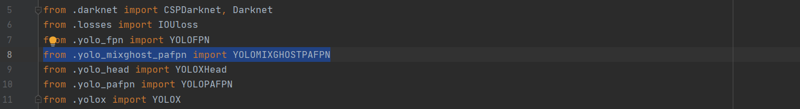
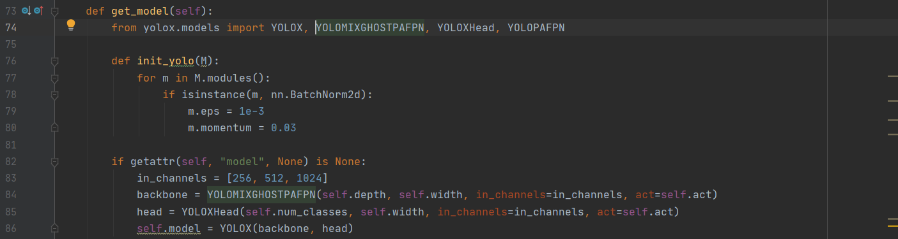

# underwater-sparseghost
the underwater organism dataset and sparseghost module

## How to start

### YOLOX-SparseGhost

<details>
<summary>Installation</summary>

Install YOLOX from source.[^1]
```shell
git clone git@github.com:Megvii-BaseDetection/YOLOX.git
cd YOLOX
pip3 install -v -e .  # or  python3 setup.py develop
```

</details>

<details>
<summary>Add modules</summary>

Add SparseGhost Module and SparseGhost-pafpn.
* Copy files [network_mixghost_blocks.py](YOLOX/yolox/models/network_mixghost_blocks.py) and [yolo_mixghost_pafpn.py](YOLOX/yolox/models/yolo_mixghost_pafpn.py) to the directory `YOLOX/yolox/model`.
* Add `from .yolo_mixghost_pafpn import YOLOMIXGHOSTPAFPN` to `YOLOX/yolox/model/__init__.py`.
<div align="center"></div>
</details>

<details>
<summary>Call module</summary>

Call MixGhost-pafpn in **yolox_base.py**.
* Add `from yolox.models import YOLOMIXGHOSTPAFPN` to `YOLOX/yolox/exp/yolox_base.py`, call `YOLOMIXGHOSTPAFPN` by `backbone = YOLOMIXGHOSTPAFPN(self.depth, self.width, in_channels=in_channels, act=self.act)`.
<div align="center"></div>
</details>

<details>
<summary>More action</summary>

More actions could be get from YOLOX's tutorial.[^2]
* [Quick run](https://github.com/Megvii-BaseDetection/YOLOX/blob/main/docs/quick_run.md)
* [Train custom data](https://github.com/Megvii-BaseDetection/YOLOX/blob/main/docs/train_custom_data.md)
* [Manipulating training image size](https://github.com/Megvii-BaseDetection/YOLOX/blob/main/docs/manipulate_training_image_size.md)
* [Freezing model](https://github.com/Megvii-BaseDetection/YOLOX/blob/main/docs/freeze_module.md)

[^1]: We have experimented on release 0.2.0, if compatibility problems are found during use, you could get source code from [YOLOX release 0.2.0](https://github.com/Megvii-BaseDetection/YOLOX/releases/tag/0.2.0)
[^2]: The main directory of YOLOX tutorials is [YOLOX release](https://github.com/Megvii-BaseDetection/YOLOX/tree/main/docs)
