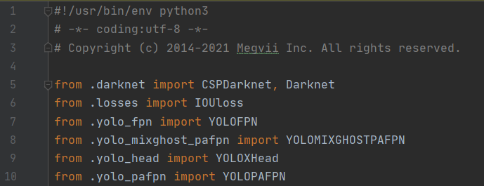

# underwater-mixghost
the underwater dataset and mixghost module

## How to start

### YOLOX-MixGhost

<details>
<summary>Installation</summary>

Step1. Install YOLOX from source.[^1]
```shell
git clone git@github.com:Megvii-BaseDetection/YOLOX.git
cd YOLOX
pip3 install -v -e .  # or  python3 setup.py develop
```

</details>

<details>
<summary>Add modules</summary>

Step2. Add MixGhost module and MixGhost-pafpn.
* Copy files [network_mixghost_blocks.py](YOLOX/yolox/models/network_mixghost_blocks.py) and [yolo_mixghost_pafpn.py](YOLOX/yolox/models/yolo_mixghost_pafpn.py) under the directory `YOLOX/yolox/model`.
* Add `from .yolo_mixghost_pafpn import YOLOMIXGHOSTPAFPN` to `YOLOX/yolox/model/__init__.py`.
<div align="center"></div>
</details>

[^1]: We have experimented on release 0.2.0, if compatibility problems are found during use, you could get source code from [YOLOX release 0.2.0](https://github.com/Megvii-BaseDetection/YOLOX/releases/tag/0.2.0)
